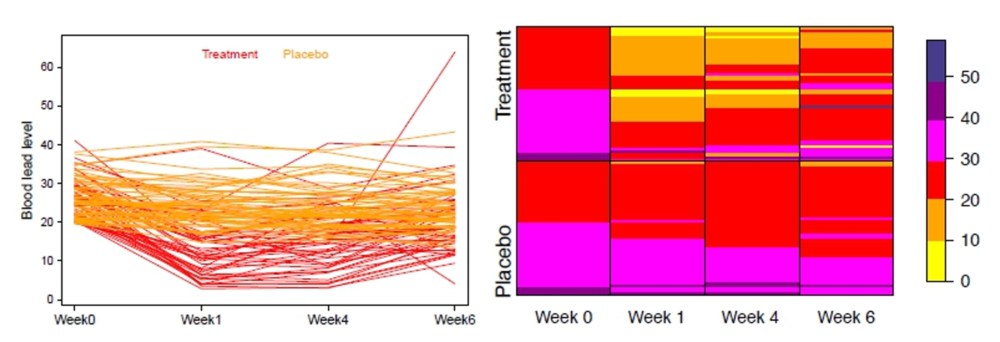
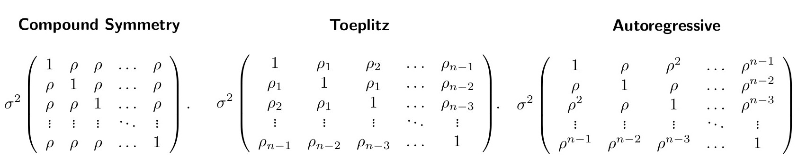

\newpage

# Terminology & Notations

We start with an introduction into the terminology and notations.

(a) Why are longitudinal data said to be clustered data?
    Give an example of a setting with clustered data that are not longitudinal.

(b) What are balanced longitudinal data?
    Are balanced data always equally-spaced?

(c) Explain the following concepts based on this graphic representing the data of two subjects A and B: inter-individual heterogeneity, longitudinal trend, within-individual biological variation.

\begin{center}
  \includegraphics{img/ex1.PNG}
\end{center}

(d) Explain the usual notations $Y_{ij}$, $t_{ij}$, $n_i$.
    In which case can we write $t_j$ instead of $t_{ij}$ and $n$ instead of $n_i$?

(e) The vector $\mathbf{Y}_i$ is defined as $\mathbf{Y}_i = \begin{pmatrix} Y_{i1} \\ \vdots \\ Y_{in} \end{pmatrix}$.
    What do the standard notations $E(\mathbf{Y}_i)$ and $Cov(\mathbf{Y}_i)$ usually denote?

(f) How can the correlation between the measurements $Y_{i1}$ and $Y_{i2}$ be derived from $Cov(\mathbf{Y}_i)$?

**Answer:**

(a) Longitudinal data are said to be clustered because measurements are taken repeatedly on the same individuals over time, creating clusters of observations within each individual.
    Each individual forms a cluster, and the repeated measurements within that individual are correlated due to shared unobserved factors (e.g., genetics or environment).
    This clustering arises because the observations within the same individual are more similar to each other than to observations from different individuals.
    But not all clustered data are longitudinal.
    A study where students are nested within classrooms is an example.
    Here, the students within the same classroom may share similar characteristics (e.g., teaching style, classroom environment), creating clusters of data.
    However, this is not longitudinal because the data are not collected over time for the same individuals.

(b) The number of repeated observations, and their timing, can vary widely from one longitudinal study to another.
    When the number and timing of the repeated measurements are the same for all individuals, the study design is said to be balanced over time (e.g., all subjects measured at weeks 0, 1, 4, and 6 in the TLC trial).
    And according to the definition, balanced data do not necessarily have to be equally-spaced.
    The key feature of balanced data is that all individuals are measured at the same set of time points, but these time points do not have to be equally spaced (e.g., measurements at days 0, 7, 30, not equally spaced but balanced if same for all).

(c) **Inter(between)-individual heterogeneity:** This refers to the differences in the response trajectories between individuals, arising from between-subject variability (different baselines or slopes due to covariates like age or genetics).
    In the graphic, subject A and subject B have different baseline levels and different rates of change over time.

    **Longitudinal trend:** This refers to the overall pattern of change in the response over time, often modeled as a function of time (e.g., linear or quadratic).
    In the graphic, both subjects A and B show a general trend of increasing responses over time, which is the longitudinal trend.

    **Within-individual biological variation:** This refers to the natural variability in the response of an individual over time, which is not explained by the overall trend and includes biological fluctuations plus measurement error.
    In the graphic, the fluctuations in the response of each subject around their individual trend line represent within-individual biological variation.

(d) 

    -   $Y_{ij}$: This denotes the response variable for the $i^{th}$ individual at the $j^{th}$ measurement occasion.
    -   $t_{ij}$: This denotes the time at which the $j^{th}$ measurement is taken for the $i^{th}$ individual.
    -   $n_i$: This denotes the number of repeated measurements for the $i^{th}$ individual.

    We can write $t_j$ instead of $t_{ij}$ and $n$ instead of $n_i$ when the study design is **balanced**, meaning that all individuals are measured at the same set of time points and have the same number of measurements.
    In this case, the time points and the number of measurements do not vary across individuals, so the notation can be simplified.

(e) $E(\mathbf{Y}_i)$ denotes the **expected value** or mean vector of the response variable for the $i^{th}$ individual.
    It represents the average response trajectory over time for that individual.
    $Cov(\mathbf{Y}_i)$ denotes the **covariance matrix** of the response variable for the $i^{th}$ individual.
    It captures the variances of the responses at each time point (diagonals) and the covariances between responses at different time points (off-diagonals), reflecting the correlation structure of the repeated measurements.

(f) The correlation between $Y_{i1}$ and $Y_{i2}$ can be derived from the covariance matrix $Cov(\mathbf{Y}_i)$ using the formula for correlation:

$$
\text{Corr}(Y_{i1}, Y_{i2}) = \frac{\text{Cov}(Y_{i1}, Y_{i2})}{\sqrt{\text{Var}(Y_{i1}) \cdot \text{Var}(Y_{i2})}}
$$

Here $\text{Cov}(Y_{i1}, Y_{i2})$ is the off-diagonal element in the covariance matrix corresponding to the covariance between $Y_{i1}$ and $Y_{i2}$.
Also $\text{Var}(Y_{i1})$ and $\text{Var}(Y_{i2})$ are the diagonal elements in the covariance matrix corresponding to the variances of $Y_{i1}$ and $Y_{i2}$, respectively.

------------------------------------------------------------------------

\newpage

# Formatting & Graphical Representation

(a) US children can be exposed to lead-based paint in deteriorating housing from before 1978 (when the paint was banned). High blood levels of lead result in risk of several adverse health effects. The dataset from the TLC trial dataset (see Fitzmaurice et al., 2004) includes $N = 100$ 12-33 months old children with high blood lead levels. The response is the blood lead level ($\mu g/dL$). The subjects are randomized to either placebo or treatment “succimer”. Measurements are conducted at baseline, week 1, week 4 and week 6 (balanced data). The spaghetti plot (left) and the lasagna plot (right) are different ways to visualize the data:

{width="655" height="229"}

1.  Load the TLC dataset and format it in the longitudinal format using the function `reshape` (use the R help).

2.  Reproduce (roughly, i.e. ignoring details) the spaghetti plot using the functions `ggplot` and `geom_line` from the package `ggplot2` (look for online help regarding the use of these functions for plotting spaghetti plots).

3.  What is the advantage of the spaghetti plot?
    In which situation(s) is the lasagna plot more appropriate?

<!-- -->

(b) The dataset from the sleep deprivation study (Belenky et al., 2003) contains daily measurements of the endpoint “average reaction time (in milliseconds, ms)” from day 0 (normal sleep) to day 8 (3 hours sleep per night on subsequent nights) for $N = 18$ subjects.

<!-- -->

1.  What are the advantages and inconveniences of the following graphical representations?

\begin{center}
  \includegraphics{img/ex2.2.PNG}
\end{center}

2.  Load the dataset `sleepstudy` from the package `lme4` and reproduce (roughly, i.e. ignoring details) the left plot using the function `xyplot` from the package `lattice` (look for online help regarding the use of this function). Do not care about the order of the subjects.

\newpage

**Answer:**

(a.1) Load the TLC dataset

```{r}
# Load the TLC data
tlc<-read.table("dat/tlc.txt",header=FALSE)
tlc_long<-reshape(data=tlc,
                  varying=list(c("V3","V4","V5","V6")),
                  times=c(0,1,4,6),
                  direction="long")
```

(a.2) Spaghetti Plot

```{r}
library(ggplot2)
p <- ggplot(data = tlc_long, aes(x = time, y = V3, group = id, col=V2))
p + geom_line()
```

(a.3) Spaghetti plot shows individual trajectories, revealing variability and trends.
Useful for small to moderate sample sizes.
Lasagna plot is better for large datasets or many time points, using color gradients (heatmap) to avoid overplotting while showing patterns.
However, lasagna can lose detail on outliers or exact values due to categorization.

\newpage

(b.1) On the plot on the left, we can see individuals trajectories and variability.
However, it can become very complicated when there are too many individuals present in the study.
The plot on the right hand side shows spaghetti plot of all the individuals with different color and showing the overall trajectory and variance.
In this plot individuals variability is becoming vague due to overplotting.

(b.2)

```{r}
# Load the package 'lme4'
library(lme4)

# Load the sleep deprivation data 
data(sleepstudy)

# Load the lattice package
library(lattice)
xyplot(Reaction~Days|Subject,data=sleepstudy,panel=function(x,y){
  panel.xyplot(x, y)
  panel.lmline(x,y)})
```

------------------------------------------------------------------------

\newpage

# Modelling of the Mean

In generalized least squares (GLS) models, the mean vector $E(\mathbf{Y}_i)$ and the covariance matrix $Cov(\mathbf{Y}_i)$ are modelled separately.
In this exercise we focus on the modelling of the mean $E(\mathbf{Y}_i)$ and ignore the covariance between the measurements.
The modelling of the covariance $\mathbf{\Sigma}_i = Cov(\mathbf{Y}_i)$ will be addressed in the next exercise and in Exercise 5, which addresses linear mixed models—a class of models in which the modelling of the covariance between measurements of the same subjects and the modelling of the mean are done simultaneously—through the consideration of so-called “random effects”.

(a) Consider the treatment group of the TLC study (see Exercise 2).
    When visually inspecting the individual curves for this group, would you say that it makes sense to model the mean as $E(Y_{ij})$ as $E(Y_{ij}) = \beta_0 + \beta_1 t_{ij}$?

(b) Which alternative modelling could we consider?
    How would the argument formula look like in R (in the formula, use `y` to denote the response and `t` to denote the time variable)?

(c) Coding the time as factor may be appropriate in case of a non-linear effect when the time points are the same for all subjects.
    Explain the idea of this approach using the example of the TLC data.

(d) Now we consider not only the treatment group but both groups simultaneously.
    A possible modelling of the mean is $$E(Y_{ij}) = \beta_0 + \beta_G G_i + \beta_T t_j + \beta'_T t^2_j + \beta_{TG} t_j G_i + \beta'_{TG} t^2_j G_i$$ where $G_i$ denotes the treatment group ($G_i = 0$ for placebo group and $G_i = 1$ for treatment group).

<!-- -->

1.  Specify the corresponding formula in R (denoting the binary treatment variable as `G`).
2.  Interpret the coefficients $\beta_G$, $\beta_T$, $\beta'_T$, $\beta_{TG}$ and $\beta'_{TG}$.
3.  What can you guess on the sign of these coefficients when inspecting the individual curves of the two groups (see Exercise 2)?

<!-- -->

(e) We now turn to the second option, considered in (c), consisting in a coding of the time as a factor: $$E(Y_{ij}) = \beta_0 + \beta_G G_i + \beta_1 I(t_j = 1) + \beta_2 I(t_j = 4) + \beta_3 I(t_j = 6) + \beta_{1G} I(t_j = 1) G_i + \beta_{2G} I(t_j = 4) G_i + \beta_{3G} I(t_j = 6) G_i$$, where $I(.)$ denotes the so-called indicator function ($I(A) = 1$ if $A$ is true, $I(A) = 0$ otherwise). Answer the same questions as for the previous modelling variant considered in (d).

**Answer:**

(a) Visual inspection of the spaghetti plot shows curvature (drop then rise), violating linearity.
    Since the treatment group shows nonlinear trends, a simple linear mean model would not be appropriate.
    A linear term alone cannot capture curvature.The linear assumption is likely invalid here.

(b) A quadratic model could be used; $E(Y_{ij})=\beta_0+\beta_1t_j+\beta_2t_j^2.$ In R: `y ~ t + I(t^2)`.

(c) Coding time as a factor allows estimating distinct means at each time point without assuming a functional form.
    For TLC data with fixed time points (0, 1, 4, 6 weeks), this captures non-linear patterns.
    The model becomes: $E(Y_{ij})=\beta_0+\beta_1I(t_j=1)+\beta_2I(t_j=4)+\beta_3I(t_j=6).$ \newline In R: `y ~ factor(t)`.

(d.1) R formula: `y ~ G + t + I(t^2) + G:t + G:I(t^2)` or `y ~ G * (t + I(t^2))`

(d.2)

-   $\beta_G$: Baseline effect of treatment at ($t=0$) in the placebo group.

-   $\beta_T$: Linear time effect for the placebo group.

-   $\beta_{T}'$: Quadratic time effect for placebo.

-   $\beta_{TG}$: Additional linear time effect for treatment group.

-   $\beta_{TG}'$: Additional quadratic time effect for treatment group.

(d.3)

-   $\beta_G$: Baseline almost zero.

-   $\beta_T$: Negative since treatment and placebo both have declines at the beginning.

-   $\beta_{T}'$: Positive since the decline in the beginning and increase at the end.

-   $\beta_{TG}$: Negative since treatment group has more decline at the beginning.

-   $\beta_{TG}'$: Positive since the curveture in treatment is more convex.

(e.1) R formula: `y ~ G * factor(t)`.

(e.2)

-   $\beta_G$: Baseline difference between groups at Week 0.

-   $\beta_1$, $\beta_2$ & $\beta_3$: Time effects (vs. Week 0) for the placebo group at Weeks 1, 4, and 6.

-   $\beta_{1G}$, $\beta_{2G}$ & $\beta_{3G}$: Additional time effects for the treatment group at Weeks 1, 4, and 6.

(e.3)

-   $\beta_1$, $\beta_2$ & $\beta_3$: Negative since there is a slight decline in placebo but close to zero.
-   $\beta_{1G}$, $\beta_{2G}$ & $\beta_{3G}$: Negative since there is a decline in treatment. The magnitude for the first two could be higher since the decline in treatment is more than placebo comparing to the last time point when the difference between placebo and treatment group decreases.

------------------------------------------------------------------------

\newpage

# Modelling of the Covariance with Marginal Models - GLS

We now turn to the covariance $Cov(\mathbf{Y}_i)$.

(a) What does “modelling of the covariance” actually mean and why is it important?

(b) Briefly explain why the covariance $cov(Y_{ij1}, Y_{ij2})$ between the $j_1$th and the $j_2$th measurements is usually not zero.
    Is this covariance generally rather positive or negative?

(c) A common (although often problematic) assumption is that the variance of the measurements is constant over time and the correlation between measurements of the same subject is the same for all pairs of measurements.

    (c.1) How is the corresponding modelling of the covariance usually denoted?

    (c.2) Write the covariance matrix in this case, using the notation $\rho$ to denote the correlation between measurements and $\sigma^2$ to denote their common variance.

(d) Is this model appropriate if observations are more similar the closer they are in time, i.e. if the correlation is decreasing with the time difference?
    Give an example of a model that may be more appropriate in this case.

(e) When the number of measurement occasions is relatively small and all individuals are measured at the same set of occasions, which modelling approach is appropriate if we do not want to make any simplifying assumptions on the form of the covariance matrix?
    Write the corresponding covariance matrix.

(f) Using the function `gls` from the package `nlme`, fit the models from (c) (setting the argument `correlation` to `correlation=corCompSymm(form = ~ 1 | id)`) and (e) (setting the argument `correlation` to `corSymm(form = ~ 1 | id)`) successively to the TLC data, thereby modelling the mean as in Exercise 3(e).
    Inspect the results with the function `summary`.

**Answer:**

(a) "Modelling of the covariance" refers to specifying the structure of the covariance matrix $Cov(Y_i)$ that accounts for dependencies between repeated measurements for a subject or within-subject dependencies.
    This is important because ignoring it could lead to incorrect estimate of $SE$.
    Also we might be interested about doing inference about covariance.

(b) The covariance $cov(Y_{ij1},Y_{ij2})$ is typically non-zero because measurements from the same subject share unobserved factors.
    The covariance is generally positive, as subjects with higher-than-average values at one time point tend to remain higher at others.
    Negative covariance is rare unless interventions cause a rebound effects (e.g., amount of food at breakfast and launch).

(c.1) This covariance structure is denoted as compound symmetry

{width="645" height="114"}

(c.2) The covariance matrix for a subject with 4 measurements is: $$\text{Cov}(\mathbf{Y}_i) = \sigma^2 
\begin{pmatrix}
1 & \rho & \rho & \rho \\
\rho & 1 & \rho & \rho \\
\rho & \rho & 1 & \rho \\
\rho & \rho & \rho & 1
\end{pmatrix}$$ where $\sigma_2$ is common variance and $\rho$ is constant correlation.

(d) No. Compound symmetry assumes constant correlation, which is unrealistic if measurements closer in time are more strongly correlated. A more appropriate model could be an autoregressive structure (AR(1)). $$\text{Cov}(\mathbf{Y}_i) = \sigma^2 
    \begin{pmatrix}
    1 & \rho & \rho^{2} & \rho^{3} \\
    \rho & 1 & \rho & \rho^{2} \\
    \rho^{2} & \rho & 1 & \rho \\
    \rho^{3} & \rho^{2} & \rho & 1
    \end{pmatrix}$$

More appropriate model would be to use an autoregressive structure (AR(1)), where the correlation decays with time lag:

$$
\text{Cov}(\mathbf{Y}_i) = \sigma^2 
\begin{pmatrix}
1 & \rho^{|1|} & \rho^{|4|} & \rho^{|6|} \\
\rho^{|1|} & 1 & \rho^{|3|} & \rho^{|5|} \\
\rho^{|4|} & \rho^{|3|} & 1 & \rho^{|2|} \\
\rho^{|6|} & \rho^{|5|} & \rho^{|2|} & 1
\end{pmatrix}
$$ Here, $\rho^{|t_j-t_k|}$ represents correlation decreasing exponentially with the time difference $|t_j-t_k|$.

(e) When all subjects are measured at the same time points, an unstructured covariance matrix allows unique variances and covariances: $$\text{Cov}(\mathbf{Y}_i) = 
    \begin{pmatrix}
    \sigma_0^2 & \sigma_{01} & \sigma_{04} & \sigma_{06} \\
    \sigma_{01} & \sigma_1^2 & \sigma_{14} & \sigma_{16} \\
    \sigma_{04} & \sigma_{14} & \sigma_4^2 & \sigma_{46} \\
    \sigma_{06} & \sigma_{16} & \sigma_{46} & \sigma_6^2
    \end{pmatrix}$$ where $\sigma_j^2$ is variance at time $j$ and $\sigma_{jk}$ is covariance between time $j$ and $k$.

(f) 

```{r}
# Reshape to long format (run once)
tlc_long <- reshape(data = tlc, varying = list(c("V3", "V4", "V5", "V6")), 
                    times = c(0, 1, 4, 6), direction = "long")
tlc_long$time <- as.factor(tlc_long$time)

# Model 1: Compound Symmetry (CS)
library(nlme)
cs_fit <- gls(V3 ~ time * V2, 
              data = tlc_long, 
              correlation = corCompSymm(form = ~1 | id))

cat("\nCompound Symmetry (CS):\n")
print(summary(cs_fit)$AIC)                # AIC, BIC, logLik
cat("Rho:", summary(cs_fit)$modelStruct$corStruct, "\n")
cat("Residual SD:", summary(cs_fit)$sigma, "\n\n")

# Model 2: Unstructured (UN)
un_fit <- gls(V3 ~ time * V2, 
              data = tlc_long, 
              correlation = corSymm(form = ~1 | id))

cat("Unstructured (UN):\n")
print(summary(un_fit)$AIC)                # AIC, BIC, logLik
cat("Correlation matrix (rounded):\n")
print(round(summary(un_fit)$modelStruct$corStruct, 3))
cat("Residual SD:", summary(un_fit)$sigma, "\n\n")

# Quick comparison note (you can add this as comment or print)
cat("Comparison:\n")
cat("UN has lower AIC (", round(summary(un_fit)$AIC,1), 
    " vs CS ", round(summary(cs_fit)$AIC,1), ") → better fit.\n")
```

With `corCompSymm`, $\rho \approx 0.60$, common $SD \approx 6.65$, and $AIC \approx 2459$.
For `corSymm`, correlations vary (0.53–0.77) with heterogeneous variance, better $AIC \approx 2450$.
Therfore, `corSymm` fits better.
It captures non-constant correlation and the increasing variance over time.

------------------------------------------------------------------------

\newpage

# Linear Mixed Model I

In this exercise, we consider again the sleep deprivation study (see Exercise 2).
We consider the simple linear mixed model:

$$
Y_{ij} = \beta_0 + \beta_1 t_{ij} + b_{i1} + b_{i2} t_{ij} + \epsilon_{ij},
$$

where

$$
\mathbf{b}_i = \begin{pmatrix} b_{i1} \\ b_{i2} \end{pmatrix} \sim N(\mathbf{0}, \mathbf{D}), \quad \mathbf{\epsilon}_i = \begin{pmatrix} \epsilon_{i1} \\ \ldots \\ \epsilon_{in_i} \end{pmatrix} \sim N(\mathbf{0}, \sigma^2 \mathbf{I}),
$$

where $\mathbf{b}_1, \ldots, \mathbf{b}_N, \mathbf{\epsilon}_1, \ldots, \mathbf{\epsilon}_{n_i}$ are independent.

\begin{center}
  \includegraphics{img/ex5.PNG}
\end{center}

(a) Explain the terms $\beta_0$ and $\beta_1$.
    Looking at the following graphic, which sign would you expect for $\beta_1$ and why?

(b) We now consider the random effects $b_{i1}$ and $b_{i2}$ more specifically.

    1.  Explain the terms $b_{i1}$ and $b_{i2}$ carefully.
    2.  In the example displayed in the following graphic, do you expect that the variances $d_{11}$ and $d_{22}$ of $b_{i1}$ and $b_{i2}$ are close to zero and why?
    3.  How would you interpret a negative covariance $d_{12}$ between $b_{i1}$ and $b_{i2}$?

(c) Suppose we now want to improve the modelling of the mean by taking the covariate sex (male: $S_i = 0$, female: $S_i = 1$) into account and consider the following model: $$
    Y_{ij} = \beta_0 + \beta_1 t_{ij} + \beta_2 S_i + \beta_3 t_{ij} S_i + b_{i1} + b_{i2} t_{ij} + \epsilon_{ij}.
    $$

    1.  Explain the fix effects $\beta_0$, $\beta_1$, $\beta_2$, and $\beta_3$.
        (also discuss the difference between fix, main and random effect)

    2.  Imagine that $\beta_2 > 0$, $\beta_1 > 0$, $\beta_3 < 0$, and $\beta_1 + \beta_3 > 0$.
        Explain in words what it means.

(d) Fit the model from (b) to the sleep deprivation dataset, which is available from the package lme4 (dataset `sleepstudy`), with the function `lmer` from the package lme4 (use the online help of the function lme4).

**Answer:**

(a) 

-   $\beta_0$: Population-average reaction time (ms) at baseline (Day 0).
-   $\beta_1$: Population-average linear change in reaction time per day of sleep deprivation.

The plot shows increasing reaction times with more sleep deprivation.
Thus, $\beta_1 > 0$.

(b.1)

-   $b_{i1}$: Random intercept for subject $i$ (deviation from $\beta_0$ in baseline reaction time).
-   $b_{i2}$: Random slope for subject $i$ (deviation from $\beta_1$ in daily change rate).

(b.2)

-   $d_{11}$ (variance of $b_{i1}$): Not close to zero. Subjects vary in baseline reaction times (e.g., some start higher/lower).
-   $d_{22}$ (variance of $b_{i2}$): Not close to zero. Subjects vary in slopes (e.g., some increase faster/slower).
-   $d_{12}$ (covariance of $b_{i1}$ & $b_{i2}$): Probably positive; Not easy to Judge visually. A negative vlaue means that those who got high value at baseline are happen to have low slope and for positive, the high value at baseline are happen to have also high slope.

(b.3) A negative covariance $d_{12}$ implies subjects with higher baseline reaction times ($b_{i1} > 0$) tend to have smaller slopes ($b_{i2} < 0$ relative to $\beta_1$).

(c.1)

-   $\beta_0$: Baseline reaction time for males ($S_i = 0$) at day 0.
-   $\beta_1$: Daily change in reaction time for males.
-   $\beta_2$: Difference in baseline reaction time between females ($S_i = 1$) and males.
-   $\beta_3$: Additional daily change for females compared to males (interaction effect).

(c.2)

-   $\beta_2 > 0$: Females start with higher baseline reaction times than males.
-   $\beta_1 > 0$: Males’ reaction times increase over days.
-   $\beta_3 < 0$: Females’ daily increase is slower than males’.
-   $\beta_1 + \beta_3 > 0$: Females reaction times also increase over days.

(d) 

```{r}
library(lme4) # Load the package 'lme4'
data(sleepstudy) # Load the sleep deprivation data 
summary(lmer(Reaction ~ Days + (Days|Subject), sleepstudy)) # Fit the model
```

In this case of modeling, we assume that the correlation between measurements are positive and if we suspect any negative associations we should not use this model.

------------------------------------------------------------------------

\newpage

# Linear Mixed Model II

We consider a study of the influence of menarche on changes in body fat accretion in girls (Bandini et al, 2002; Phillips et al, 2003).
162 pre-menarcheal non-obese schoolgirls were recruited for the study, and annual measurements were scheduled until four years after menarche.
The endpoint of interest was the percent body fat (% BF).
The hypothesis of the doctors to be considered in this study was that % BF increases linearly with age, but with different slopes before and after menarche.
For the purpose of simplicity, we assume that there are no missing values.

(a) Why does it make sense to set $t = 0$ at the time of menarche?

(b) Can the resulting dataset be considered as balanced?

(c) Which modelling of the mean corresponds to the hypothesis of the doctors?

<!-- -->

**Answer:**

(a) Setting $t = 0$ at the time of menarche centers the time scale on a key biological event. This allows the model to clearly separate the pre-menarche period ($t < 0$) from the post-menarche period ($t > 0$), enabling distinct slope estimates for the rate of change in percent body fat (%BF) before and after this milestone. It directly tests the hypothesis that %BF increases linearly with age but with a change in slope after menarche.

<!-- -->

(b) The dataset **cannot be considered balanced** because:

-   Girls are having their menarche at different ages,\
-   While measurements were scheduled annually until 4 years post-menarche, the timing of menarche itself varies across subjects.

So the time points (relative to $t = 0$) differ between individuals.
This results in unbalanced longitudinal data, with varying numbers of pre- and post-menarche observations and irregular spacing across subjects.

(c) The doctors' hypothesis corresponds to a **piecewise linear mixed model**:\
    $$
    \text{BF}_{ij} = \beta_0 + \beta_1 t_{ij} + \beta_2 (t_{ij})_+ + b_{i0} + b_{i1} t_{ij} + b_{i2} (t_{ij})_+ + \epsilon_{ij},
    $$\
    where:\

-   $(t_{ij})_+ = \max(t_{ij}, 0)$: Post-menarche time.\
-   $\beta_1$: Slope before menarche.\
-   $\beta_2$: Change in slope after menarche.\
-   $b_{i0}, b_{i1}, b_{i2}$: Random intercept, pre- and post-menarche slopes to account for between-girl heterogeneity in baseline %BF and growth trajectories.

------------------------------------------------------------------------

\newpage

# GEE vs. Generalized Linear Mixed Model (GLMM)

We now turn to the case of non-normally distributed dependent variables.

(a) Explain in 2-3 sentences the difference between GEE and GLMM.

(b) Explain the arguments `formula`, `id`, `family` and `corstr` of the function `gee` (package `gee`).

**Answer:**

(a) 

    -   **Generalized estimating equations** (GEE) are a **marginal modeling approach** that focuses on estimating population-averaged effects across the entire group of subjects.
        In GEE, the mean response is modeled as $E(Y_{ij}) = g^{-1}(X_{ij} \beta)$, where $g$ is a link function (e.g., logit for binary data), $X_{ij}$ are covariates, and $\beta$ are the fixed coefficients representing average effects in the population; the correlation between repeated measures is treated as a "nuisance" parameter using a working correlation matrix (e.g., exchangeable or AR(1)), and robust standard errors ensure valid inference even if the correlation is misspecified.
        This means GEE answers questions like "*On average, how does treatment affect blood lead levels across all children?*" without focusing on individual differences.

    -   In contrast, **generalized linear mixed models** (GLMM) are a **subject-specific modeling approach** that explicitly incorporates random effects to capture individual-level variation.
        The model is $Y_{ij} \sim f(\mu_{ij}, \phi)$, with $g(\mu_{ij}) = X_{ij} \beta + Z_{ij} b_i$, where $b_i \sim N(0, D)$ are random effects (e.g., random intercepts or slopes per subject), allowing the model to account for within-subject correlation through these subject-specific deviations; this assumes the random effects distribution is correct for accurate results.
        GLMMs allow direct estimation of both population-level fixed effects ($\beta$, like average treatment impact) and individual-level predictions (e.g., predicted response trajectory for a specific child by adding their estimated $b_i$), making them suitable for questions like "How does treatment affect this particular child's blood lead levels, accounting for their unique baseline?"

        The key difference is that GEE provides robust, average effects for the population without requiring a correct correlation model, while GLMM provides more detailed, personalized insights but relies on accurate specification of the random effects.

(b) The arguments `formula`, `id`, `family` and `corstr` of the function gee in package gee:

-   `formula`: Specifies the model for the mean, e.g., `y ~ x1 + x2 + time`, similar to standard regression formulas.

-   `id`: The clustering variable that identifies repeated measures on the same subject (e.g., `id = subject_id`).

-   `family`: Specifies the distribution and link function for the response variable, e.g., `family = binomial(link = "logit")` for binary outcomes or `family = gaussian` for continuous normal responses.

-   `corstr`: Specifies the working correlation structure assumed among repeated measures within a subject; common options include "`independence`" (no correlation), "`exchangeable`" (constant correlation), "`ar1`" (autoregressive order 1, decaying with time lag), or "`unstructured`" (fully general).

------------------------------------------------------------------------
